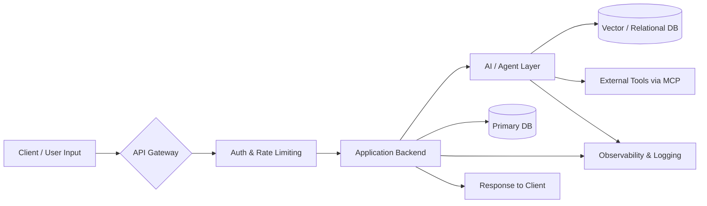
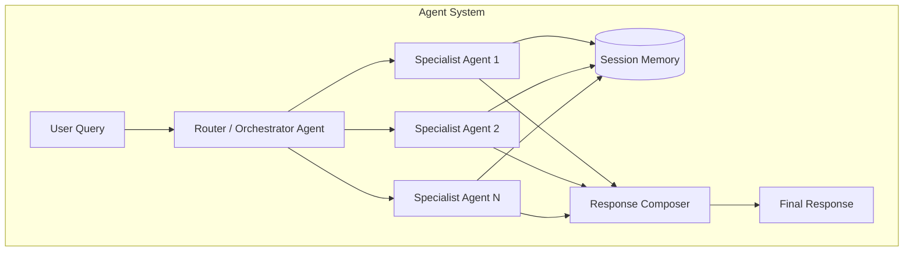
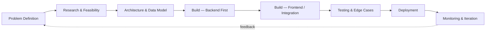
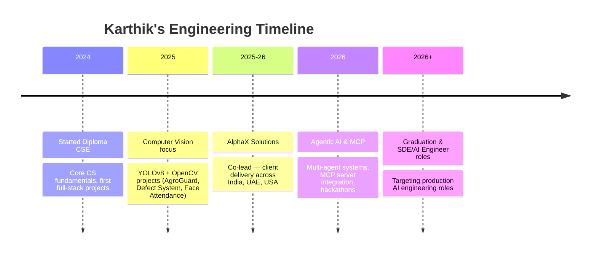

<!-- ═══════════════════════════════════════════════════════════════════════
     KARTHIK K — GITHUB PROFILE README v2.0
     Cyberpunk Dashboard Theme | Cyan · Violet · Magenta
     Palette: #0a0a0f · #06b6d4 · #8b5cf6 · #ec4899 · #22d3ee
     ═══════════════════════════════════════════════════════════════════════ -->

<div align="center">


<a href="https://github.com/karthikk20234119-cmd">
  
</a>

<br/>


</div>

<br/>

<!-- ═══════════════════════════════════════════════════════════════════════
     01 · HERO / INTRODUCTION
     ═══════════════════════════════════════════════════════════════════════ -->

##  About Me

<table>
<tr>
<td width="65%" valign="top">

I'm a Computer Science Engineering student (Diploma, expected 2026) from Madurai, Tamil Nadu, working at the intersection of **applied AI, computer vision, and full-stack engineering**. I co-lead **AlphaX Solutions**, a student-run AI automation studio building for clients across India, the UAE, and the US — which means I spend as much time on client architecture decisions and delivery deadlines as I do on coursework.

My engineering philosophy is simple: **a model in a notebook isn't a product.** I care about the unglamorous 80% — API design, auth, observability, deployment — that turns a proof of concept into something a real user can depend on. Most of what's below reflects that: computer vision systems wired into working dashboards, agent systems with actual memory and logging, not just a clever prompt.

Currently deep in **agentic AI architecture** — multi-agent orchestration, Model Context Protocol (MCP) tooling, and retrieval systems — while keeping the full-stack fundamentals (React/Node, Flask, SQL/NoSQL) sharp enough to ship the whole product end to end.

</td>
<td width="35%" valign="top" align="center">

```yaml
name: Karthik K
role: AI Engineer / Full Stack Developer
education: Diploma CSE, 2026 (CGPA 9.1/10)
location: Madurai, Tamil Nadu, IN
current_role: Co-Lead, AlphaX Solutions
markets_served: India · UAE · USA
looking_for: SDE / AI Engineer roles
```

</td>
</tr>
</table>

<br/>

<!-- ═══════════════════════════════════════════════════════════════════════
     02 · AI ENGINEERING DASHBOARD
     ═══════════════════════════════════════════════════════════════════════ -->

##  AI Engineering Dashboard

<table>
<tr>
<td width="50%" valign="top">

**Computer Vision & ML**

<br/>
<br/>
<br/>


</td>
<td width="50%" valign="top">

**Agentic AI & LLM Tooling**

<br/>
<br/>
<br/>


</td>
</tr>
</table>

**What "agentic AI" means in my work — concretely:**

| Capability | Where I've applied it |
|---|---|
| Multi-agent orchestration | `Smart-HomeWork-Helper-Agent` — 4 specialized agents coordinating on a single tutoring session |
| Memory systems | Session-persistent context so agents don't re-ask what they already know |
| Observability | Logging/metrics on agent behavior, not just output — so failures are debuggable |
| MCP servers | Explored and configured MCP server integrations (`notebooklm-py`) inside Claude Desktop for tool-augmented workflows |
| Prompt engineering | Structured, role-scoped prompts per agent rather than one monolithic system prompt |

<br/>

<!-- ═══════════════════════════════════════════════════════════════════════
     03 · SKILLS DASHBOARD
     ═══════════════════════════════════════════════════════════════════════ -->

##  Skills Dashboard

<h4>Languages</h4>
<p>


</p>

<h4>Frontend</h4>
<p>


</p>

<h4>Backend</h4>
<p>


</p>

<h4>Data & Cloud</h4>
<p>


</p>

<h4>AI / ML / Agents</h4>
<p>


</p>

<h4>Tools & Platforms</h4>
<p>


</p>

<br/>

<!-- ═══════════════════════════════════════════════════════════════════════
     04 · FEATURED PROJECTS (verified repos only)
     ═══════════════════════════════════════════════════════════════════════ -->

##  Featured Projects

> Every project below links to a real, public repository. Case studies without a public repo are marked as such — no invented metrics.

### 

**The problem:** Generic tutoring tools give one-size-fits-all answers. Students need a tutor that adapts its approach per subject and remembers context across a session instead of starting cold on every question.

**Architecture:** A multi-agent system where four specialized agents divide responsibility (e.g. subject reasoning, explanation style, memory/context, and session orchestration) rather than one monolithic prompt handling everything. Includes session memory so follow-up questions don't lose context, and observability metrics so agent behavior is traceable rather than a black box.

**Stack:** TypeScript, agent orchestration framework, memory store, logging/metrics layer

**Why it's engineered, not just prompted:** the memory and observability layers are what separate this from a single ChatGPT wrapper — it's built to be debugged and improved, not just demoed once.

**Possible next step:** add automated eval scoring per agent so regressions in tutoring quality are caught before they reach a session.

🔗 [Repository](https://github.com/karthikk20234119-cmd/Smart-HomeWork-Helper-Agent)

<br/>

### 

**The problem:** Smallholder farmers often catch crop disease too late for cheap intervention, because expert diagnosis isn't accessible or fast.

**Architecture:** Real-time object detection pipeline using YOLOv8 for disease/pest localization on leaf imagery, with OpenCV handling pre/post-processing. Designed for rapid inference so results are usable in the field, not just in a research notebook.

**Stack:** Python, YOLOv8, OpenCV

**Possible next step:** package the inference pipeline behind a lightweight mobile-friendly API so it's usable directly from a phone camera in the field.

🔗 [Repository](https://github.com/karthikk20234119-cmd/Smart_Real_Time_Object_detection)

<br/>

### 

**The problem:** Manual attendance is slow and easy to game (proxy attendance). Institutions need a system that's fast to run and hard to fake.

**Architecture:** Real-time face detection/recognition pipeline with automated logging through a backend API, plus an admin dashboard for exportable attendance records — built as a full system, not just a detection script.

**Stack:** PHP, face recognition pipeline, backend API, admin dashboard

**Possible next step:** add liveness detection to further harden against photo-based spoofing.

🔗 [Repository](https://github.com/karthikk20234119-cmd/Face_Attendance_System)

<br/>

### 

**The problem:** Manual visual QA on production lines is slow, inconsistent between inspectors, and doesn't scale.

**Architecture:** Computer-vision-based defect detection pipeline aimed at catching visual defects earlier and more consistently than manual review.

**Stack:** Python, computer vision pipeline

🔗 [Repository](https://github.com/karthikk20234119-cmd/AI-Powered-Defect-System)

<br/>

### Case Studies — build complete, repo not yet public

<table>
<tr>
<td width="33%" valign="top">

**LabLink**
Lab asset/inventory management system built for booking coordination across shared lab resources — designed to eliminate scheduling overlaps through a role-based booking model.
<br/><sub>React · Node · MongoDB</sub>

</td>
<td width="33%" valign="top">

**PlacementOS**
Campus placement platform connecting students and recruiters — job tracking, recruiter-facing portal, and role-based access for placement staff.
<br/><sub>Full-stack · RBAC · JWT</sub>

</td>
<td width="33%" valign="top">

**MarkOne AI**
Sales/marketing automation concept exploring NLP-driven query understanding and personalized recommendation flows.
<br/><sub>NLP · Generative AI</sub>

</td>
</tr>
</table>

<br/>

<!-- ═══════════════════════════════════════════════════════════════════════
     05 · SYSTEM ARCHITECTURE (Mermaid)
     ═══════════════════════════════════════════════════════════════════════ -->

##  How I Architect a Typical AI Product





<br/>

<!-- ═══════════════════════════════════════════════════════════════════════
     06 · DEVELOPMENT WORKFLOW
     ═══════════════════════════════════════════════════════════════════════ -->

##  Development Workflow



I default to backend-and-data-model-first because it's cheaper to fix an API contract before a UI is built against it than after.

<br/>

<!-- ═══════════════════════════════════════════════════════════════════════
     07 · GITHUB ANALYTICS
     ═══════════════════════════════════════════════════════════════════════ -->

##  GitHub Analytics

<table>
<tr>
<td width="50%">

</td>
<td width="50%">

</td>
</tr>
<tr>
<td width="50%">

</td>
<td width="50%">

</td>
</tr>
</table>


<br/>

<!-- ═══════════════════════════════════════════════════════════════════════
     08 · ACHIEVEMENTS
     ═══════════════════════════════════════════════════════════════════════ -->

##  Achievements

| | |
|---|---|
| 🏆 **QS ImpACT Skills Challenge 2026** | Top 10 Global Finalist — international competition advancing UN SDGs through applied technology |
| 💻 **HackSpora 2K25** | Participant, national-level AI & Data Science hackathon |

<br/>

<!-- ═══════════════════════════════════════════════════════════════════════
     09 · CERTIFICATIONS
     ═══════════════════════════════════════════════════════════════════════ -->

##  Certifications

<p>


</p>
<p>


</p>

<br/>

<!-- ═══════════════════════════════════════════════════════════════════════
     10 · LEARNING ROADMAP / TIMELINE
     ═══════════════════════════════════════════════════════════════════════ -->

##  Learning Roadmap

| Phase | Focus | Status |
|:---:|---|:---:|
| Now | MCP servers, multi-agent orchestration (LangGraph/CrewAI depth) | In Progress |
| Next | RAG systems & vector databases at production scale | In Progress |
| Then | MLOps — model deployment, monitoring, versioning | Planned |
| Later | Distributed systems & system design at scale | Planned |
| Ongoing | Open-source contribution habit | Building |

<br/>

##  Tech Timeline



<br/>

<!-- ═══════════════════════════════════════════════════════════════════════
     11 · OPEN SOURCE PHILOSOPHY
     ═══════════════════════════════════════════════════════════════════════ -->

##  Open Source Philosophy

I treat my public repos as things other people might actually clone and run — which means the READMEs, setup steps, and code comments matter as much as the core logic. I'm early in building a consistent open-source contribution habit (see Learning Roadmap above) rather than claiming a contribution history I don't yet have.

<br/>

<!-- ═══════════════════════════════════════════════════════════════════════
     12 · DEVELOPER PRINCIPLES
     ═══════════════════════════════════════════════════════════════════════ -->

##  Developer Principles

1. A demo isn't a product — auth, logging, and edge cases aren't optional extras.
2. If an agent's behavior can't be logged, it can't be trusted.
3. Backend and data model first; UI is easier to fix than a bad schema.
4. Ship the smallest version that's actually usable, then iterate.
5. Every metric I put in front of someone has to be one I can defend.
6. Client work sharpens engineering judgment faster than tutorials do.
7. Read the error before you read Stack Overflow.
8. Prefer boring, well-understood tools unless there's a real reason not to.
9. Code that only I can maintain is a liability, not an asset.
10. Understand the "why" behind a framework before reaching for it.

<br/>

<!-- ═══════════════════════════════════════════════════════════════════════
     13 · CONTACT
     ═══════════════════════════════════════════════════════════════════════ -->

##  Connect

<p align="center">
<a href="https://karthik-k-portfolio.vercel.app/" target="_blank"></a>
<a href="https://linkedin.com/in/karthikk4" target="_blank"></a>
<a href="https://github.com/karthikk20234119-cmd" target="_blank"></a>
<a href="mailto:karthikk.dev@gmail.com"></a>
</p>

<br/>


<p align="center"><sub><i>"Ship the whole thing, not just the clever part."</i></sub></p>

