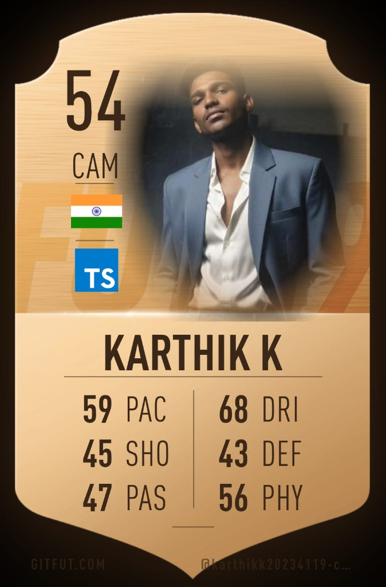
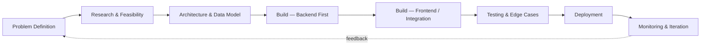

<!-- ⚔️ ═══════════════════════════════════════════════════════════════════════
     KARTHIK K — GITHUB PROFILE README v4.0 (Game of Thrones Edition)
     Theme: Ancient Stone, Charcoal, Gold, and Crimson
     Palette: #111116 · #d4af37 · #800020 · #ffd700 · #e6c875
     ═══════════════════════════════════════════════════════════════════════ ⚔️ -->

  

   

  

    

  
  
  
  

 

  ⚔️ ═════════════════════════════════════════════════════════════ ⚔️

<!-- ═══════════════════════════════════════════════════════════════════════
     01 · THE KINGDOM (HERO / EXECUTIVE PROFILE)
     ═══════════════════════════════════════════════════════════════════════ -->

<table>
  <tr>
    <td width="33%" valign="top" align="center">
       
      
        
      

        
        
        
      

    </td>
    <td width="67%" valign="top">
      <h2>⚔️ The Kingdom of Code</h2>
      

        I am a Computer Science Engineering student (Diploma, Class of 2026) based in Madurai, Tamil Nadu, operating at the intersection of <b>applied artificial intelligence, computer vision, and robust full-stack engineering</b>.
      

      

        As the Co-Lead of <b>House AlphaX Solutions</b>, a student-run AI automation studio, I forge and deliver production-grade systems for clients spanning India, the UAE, and the United States. I bridge the gap between academic theory and industry deadlines.
      

      <blockquote>
        <b>The Oath of Forging:</b> "A model in a Jupyter Notebook is not a product. Real engineering lives in the unglamorous 80%—observability, security, database performance, and API design."
      </blockquote>
      <h4>Current Quests:</h4>
      <ul>
        <li>🤖 Command production-scale <b>Agentic AI Orchestrator Pipelines</b> (LangGraph, CrewAI).</li>
        <li>🔌 Forging custom <b>Model Context Protocol (MCP)</b> servers to connect LLMs with local/remote data.</li>
        <li>👁️ Unleashing edge-optimized <b>Computer Vision</b> models (YOLOv8, OpenCV) to target real-world quality control.</li>
      </ul>
    </td>
  </tr>
</table>

 

<!-- ═══════════════════════════════════════════════════════════════════════
     02 · TABLE OF CONTENTS
     ═══════════════════════════════════════════════════════════════════════ -->

## 📜 Scrolls of Navigation
- [👑 The Developer & Philosophy](#the-developer--philosophy)
- [⚔️ The Arsenal (Tech Stack)](#the-arsenal-tech-stack)
- [🐉 The Dragons (Featured Projects)](#the-dragons-featured-projects)
- [⚡ Battle Statistics (GitHub Analytics)](#battle-statistics-github-analytics)
- [🏆 Certifications & Achievements](#certifications--achievements)
- [⚙️ The Citadel Code (Principles & Workflow)](#the-citadel-code-principles--workflow)
- [📬 Send a Raven (Connect)](#send-a-raven-connect)

 

  ⚔️ ═════════════════════════════════════════════════════════════ ⚔️

<!-- ═══════════════════════════════════════════════════════════════════════
     03 · ABOUT ME / THE DEVELOPER & PHILOSOPHY
     ═══════════════════════════════════════════════════════════════════════ -->

## 👑 The Developer & Philosophy

I care deeply about building software that is maintainable, traceable, and actually gets shipped to users. My passion is translating cutting-edge AI breakthroughs into real-world business value. Whether it's wiring real-time defect detection into a production assembly line or orchestrating multi-agent systems with persistent memory databases, I ensure every system is highly observable and robust.

### 🎯 Key Focus Areas
- **Agentic Architectures**: Implementing session-persistent memory and observability layers to move agents beyond simple prompting.
- **Edge Computer Vision**: Running optimized neural networks on constrained hardware for real-time inference.
- **Full-Stack Orchestration**: Designing scalable, secure backends to support complex UI layers.

 

  ⚔️ ═════════════════════════════════════════════════════════════ ⚔️

<!-- ═══════════════════════════════════════════════════════════════════════
     04 · THE ARSENAL (TECH STACK)
     ═══════════════════════════════════════════════════════════════════════ -->

## ⚔️ The Arsenal (Tech Stack)

<table>
  <tr>
    <td width="22%"><b>Valyrian Steel (Languages)</b></td>
    <td>
      
      
      
      
      
      
    </td>
  </tr>
  <tr>
    <td><b>Dragonfire (AI & ML)</b></td>
    <td>
      
      
      
      
      
      
      
    </td>
  </tr>
  <tr>
    <td><b>Castle Gates (Backend & API)</b></td>
    <td>
      
      
      
      
    </td>
  </tr>
  <tr>
    <td><b>Shield Walls (Frontend)</b></td>
    <td>
      
      
      
      
    </td>
  </tr>
  <tr>
    <td><b>Vaults & Keep (Databases & Cloud)</b></td>
    <td>
      
      
      
      
    </td>
  </tr>
  <tr>
    <td><b>War Tactics (DevOps & Tools)</b></td>
    <td>
      
      
      
      
      
      
    </td>
  </tr>
</table>

 

  ⚔️ ═════════════════════════════════════════════════════════════ ⚔️

<!-- ═══════════════════════════════════════════════════════════════════════
     05 · THE DRAGONS (FEATURED PROJECTS)
     ═══════════════════════════════════════════════════════════════════════ -->

## 🐉 The Dragons (Featured Projects)

### 🤖 Smart Homework Helper Agent
> **Autonomous Multi-Agent Tutoring System**

- **The Siege (Problem)**: Standard educational bots give boilerplate answers. Students need interactive, adaptive instruction that remembers context across sessions.
- **The Blueprint (Architecture)**: Orchestrates four specialized agents (Orchestrator, Subject Expert, Explanation Adapter, and Memory/Context Logger) with a central Session Memory Keep and built-in observability logging for debugging.
- **The Alloy (Tech Stack)**: `TypeScript`, `Node.js`, `LangGraph`, `Express.js`, `Memory DB`
- **Links**: 🔗 [Repository](https://github.com/karthikk20234119-cmd/Smart-HomeWork-Helper-Agent)

---

### 🌾 AgroGuard AI
> **Real-Time Agricultural Disease & Pest Detection Pipeline**

- **The Siege (Problem)**: Crop diseases cause severe losses when detected late. Farmers require instant, localized diagnostic tools in the field.
- **The Blueprint (Architecture)**: Core computer vision pipeline utilizing custom YOLOv8 models for real-time object detection and OpenCV for frame pre-processing and target localization.
- **The Alloy (Tech Stack)**: `Python`, `YOLOv8`, `OpenCV`
- **Links**: 🔗 [Repository](https://github.com/karthikk20234119-cmd/Smart_Real_Time_Object_detection)

---

### 🆔 Face Recognition Attendance System
> **Secure Biometric Logging Platform**

- **The Siege (Problem)**: Manual attendance methods are inefficient and highly vulnerable to proxy check-ins.
- **The Blueprint (Architecture)**: Real-time biometric face detection/recognition module wired directly to a secure central database, managed via a responsive administrator dashboard.
- **The Alloy (Tech Stack)**: `PHP`, `JavaScript`, `OpenCV`, `MySQL`, `REST API`
- **Links**: 🔗 [Repository](https://github.com/karthikk20234119-cmd/Face_Attendance_System)

---

### 🏭 AI-Powered Defect System
> **Industrial Visual Quality Assurance Pipeline**

- **The Siege (Problem)**: Manual inspection in manufacturing is slow, subjective, and creates massive bottlenecks.
- **The Blueprint (Architecture)**: High-speed edge computer vision pipeline designed to analyze assembly line products, identify surface flaws, and output automated defect logs.
- **The Alloy (Tech Stack)**: `Python`, `OpenCV`, `TensorFlow`
- **Links**: 🔗 [Repository](https://github.com/karthikk20234119-cmd/AI-Powered-Defect-System)

---

💼 <b>Commercial Case Studies (Private Repositories)</b>

 

| Quest Name | Role/Description | The Alloy (Stack) |
|---|---|---|
| **LabLink** | Multi-institution inventory and resource booking coordinator. Eliminates scheduling overlaps. | React, Node.js, MongoDB |
| **PlacementOS** | Campus placement tracking system connecting recruiters, staff, and job seekers with RBAC. | React, JWT, Express, PostgreSQL |
| **MarkOne AI** | NLP-driven marketing platform featuring personalized recommendations and chat flows. | NLP, Generative AI, Python |

 

  ⚔️ ═════════════════════════════════════════════════════════════ ⚔️

<!-- ═══════════════════════════════════════════════════════════════════════
     06 · BATTLE STATISTICS (GITHUB ANALYTICS)
     ═══════════════════════════════════════════════════════════════════════ -->

## ⚡ Battle Statistics (GitHub Analytics)

  <table border="0">
    <tr>
      <td width="50%" align="center">
        
      </td>
      <td width="50%" align="center">
        
      </td>
    </tr>
    <tr>
      <td width="50%" align="center">
        
      </td>
      <td width="50%" align="center">
        
      </td>
    </tr>
  </table>
  
   
  
  
  
    
  
  <h3>🐉 Contribution Activity Map</h3>
  
  <picture>
    <source media="(prefers-color-scheme: dark)" srcset="https://raw.githubusercontent.com/karthikk20234119-cmd/karthikk20234119-cmd/output/github-snake-dark.svg" />
    <source media="(prefers-color-scheme: light)" srcset="https://raw.githubusercontent.com/karthikk20234119-cmd/karthikk20234119-cmd/output/github-snake.svg" />
    
  </picture>

 

  ⚔️ ═════════════════════════════════════════════════════════════ ⚔️

<!-- ═══════════════════════════════════════════════════════════════════════
     07 · CERTIFICATIONS & ACHIEVEMENTS
     ═══════════════════════════════════════════════════════════════════════ -->

## 🏆 Certifications & Achievements

### 🌟 Legendary Milestones
- **QS ImpACT Skills Challenge 2026**: Top 10 Global Finalist (international hackathon solving UN SDGs).
- **HackSpora 2K25**: National-level AI and Data Science hackathon participant.

📜 <b>Scrolls of Knowledge (Certifications & Internships)</b>

 

- **Google / Kaggle**: Certified in Machine Learning, Deep Learning, and Advanced Data Analysis.
- **Infosys Springboard**: Full-Stack Development and Software Engineering Foundations.
- **GUVI x HCL**: Deep Learning and Advanced Image Processing.
- **Realm Virtual Simulations (Internships)**:
  - **Deloitte**: Technology Consultant Simulation.
  - **TATA**: Software Engineering Simulation.
  - **Mastercard**: Cybersecurity Analyst Program.
  - **J.P. Morgan**: Software Engineering Virtual Program.

 

  ⚔️ ═════════════════════════════════════════════════════════════ ⚔️

<!-- ═══════════════════════════════════════════════════════════════════════
     08 · THE CITADEL CODE (PRINCIPLES & WORKFLOW)
     ═══════════════════════════════════════════════════════════════════════ -->

## ⚙️ The Citadel Code (Principles & Workflow)

<b>🔍 Expand workflow details & guidelines</b>

 

### 🔄 Forging Lifecycle (Development Workflow)

### 💡 Core Engineering Oaths
1. **A demo is not a product** — Authentication, robust logging, and graceful error handling are core requirements, not afterthoughts.
2. **If an agent's behavior cannot be logged, it cannot be trusted** — Observability is paramount in non-deterministic systems.
3. **Data models and API contracts first** — A UI is trivial to replace; a bad database schema is permanent technical debt.
4. **Ship early, iterate fast** — Deploy the minimum viable, highly functional unit, then scale.
5. **Always read the error stack** — Understand the root cause before reaching for quick fixes or Stack Overflow.
6. **Code that only I can maintain is a liability** — Write clean, documented, and testable code.

 

  ⚔️ ═════════════════════════════════════════════════════════════ ⚔️

<!-- ═══════════════════════════════════════════════════════════════════════
     09 · SEND A RAVEN (CONNECT & FOOTER)
     ═══════════════════════════════════════════════════════════════════════ -->

## 📬 Send a Raven (Connect)

  
  
  

 

  
   
  <i>"Winter is coming, but code stands forever. Ship the whole thing, not just the clever part."</i>

