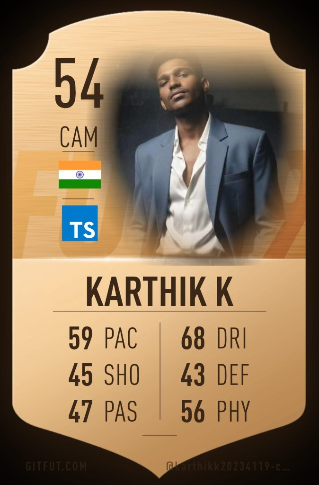
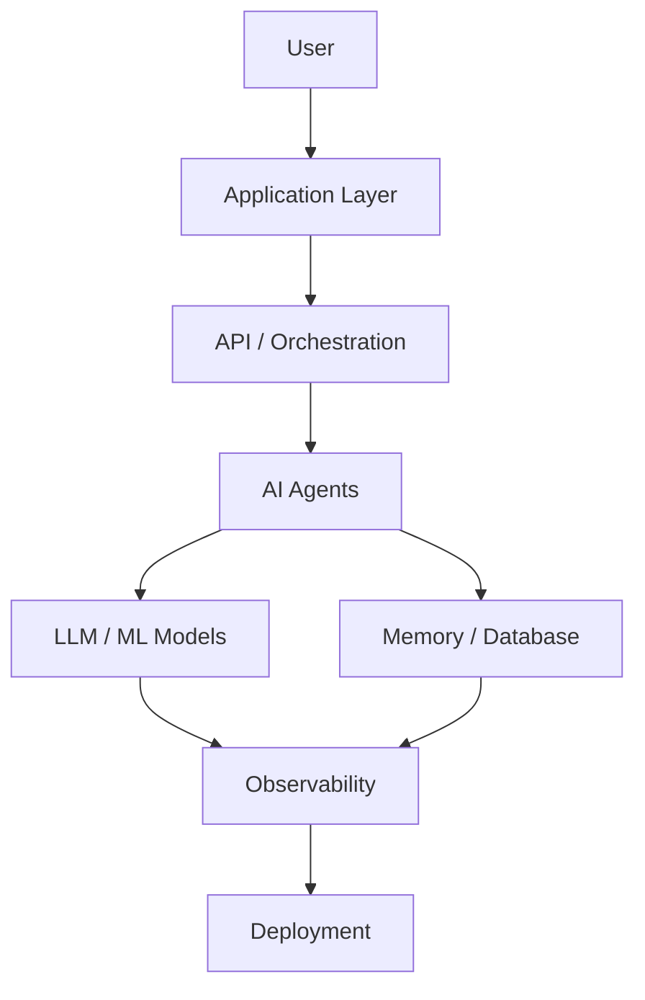
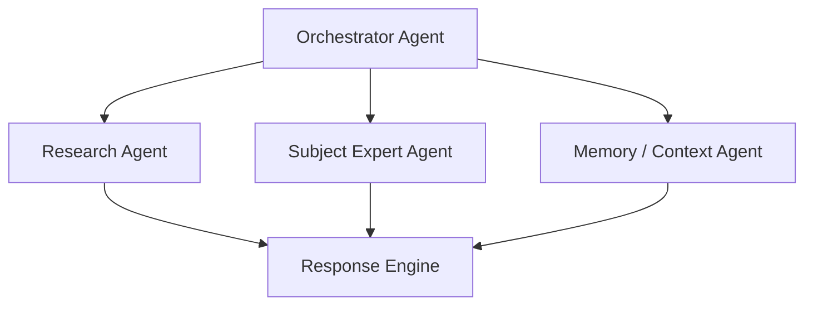
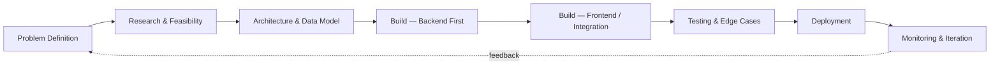

<!-- ═══════════════════════════════════════════════════════════════════════
     KARTHIK K — GITHUB PROFILE README v5.0
     Cinematic AI Engineering Command Center
     Palette: #08090D · #111116 · #181A20 · #D4AF37 · #FFD700 · #800020 · #22D3EE · #8B5CF6
     ═══════════════════════════════════════════════════════════════════════ -->

  

    

  

    

  
  
  
  

 

> Building production-grade AI systems that connect intelligent models, reliable software, and real-world business workflows.

 

## Contents
- [Developer Command Card](#developer-command-card)
- [About / Engineering Identity](#about--engineering-identity)
- [AI Engineering Stack](#ai-engineering-stack)
- [System Architecture](#system-architecture)
- [Agentic AI Network](#agentic-ai-network)
- [Featured Projects](#featured-projects)
- [Engineering Telemetry](#engineering-telemetry)
- [Achievements](#achievements)
- [Engineering Oaths](#engineering-oaths)
- [Connect](#connect)

 

━━━━━━━━━━━━━━━━━━━━━━━━━━━━━━━━━━━━━━ ◆ ━━━━━━━━━━━━━━━━━━━━━━━━━━━━━━━━━━━━━━

<!-- ═══════════════════════════════════════════════════════════════════════
     DEVELOPER COMMAND CARD
     ═══════════════════════════════════════════════════════════════════════ -->

## Developer Command Card

<table>
  <tr>
    <td width="34%" valign="top" align="center">
       
      
        
      
      
      
    </td>
    <td width="66%" valign="top">
      <h3>Karthik K &mdash; AI Engineer</h3>
      

        Computer Science Engineering student (Diploma, Class of 2026) based in Madurai, Tamil Nadu, operating at the intersection of <b>applied artificial intelligence, computer vision, and full-stack engineering</b>.
      

      

        As Co-Lead of <b>AlphaX Solutions</b>, a student-run AI automation studio, I build and deliver production-grade systems for clients spanning India, the UAE, and the United States &mdash; bridging academic theory with industry deadlines.
      

      <blockquote>
        <b>Core Principle:</b> "A model in a Jupyter Notebook is not a product. Real engineering lives in the unglamorous 80%&mdash;observability, security, database performance, and API design."
      </blockquote>
      <b>Current Focus</b>
      <ul>
        <li>Production-scale <b>Agentic AI Orchestrator Pipelines</b> (LangGraph, CrewAI)</li>
        <li>Custom <b>Model Context Protocol (MCP)</b> servers connecting LLMs to local/remote data</li>
        <li>Edge-optimized <b>Computer Vision</b> models (YOLOv8, OpenCV) for real-world quality control</li>
      </ul>
    </td>
  </tr>
</table>

 

━━━━━━━━━━━━━━━━━━━━━━━━━━━━━━━━━━━━━━ ◆ ━━━━━━━━━━━━━━━━━━━━━━━━━━━━━━━━━━━━━━

<!-- ═══════════════════════════════════════════════════════════════════════
     ABOUT / ENGINEERING IDENTITY
     ═══════════════════════════════════════════════════════════════════════ -->

## About / Engineering Identity

<table>
  <tr>
    <td width="25%" valign="top">
      <h4>AI Systems</h4>
      
Agentic AI, LLM orchestration, MCP, intelligent automation.

    </td>
    <td width="25%" valign="top">
      <h4>Computer Vision</h4>
      
YOLOv8, OpenCV, real-time detection, edge inference.

    </td>
    <td width="25%" valign="top">
      <h4>Full-Stack Engineering</h4>
      
React, Node.js, Python, APIs, databases, production systems.

    </td>
    <td width="25%" valign="top">
      <h4>Engineering Philosophy</h4>
      
Observability, scalability, security, maintainability.

    </td>
  </tr>
</table>

I care about building software that is maintainable, traceable, and actually gets shipped to users. My focus is translating AI breakthroughs into real business value &mdash; whether that's wiring real-time defect detection into a production assembly line, or orchestrating multi-agent systems with persistent memory. Every system I build is designed to be observable and robust.

**Key Focus Areas**
- **Agentic Architectures** &mdash; session-persistent memory and observability layers that move agents beyond simple prompting
- **Edge Computer Vision** &mdash; optimized neural networks on constrained hardware for real-time inference
- **Full-Stack Orchestration** &mdash; scalable, secure backends supporting complex UI layers

 

━━━━━━━━━━━━━━━━━━━━━━━━━━━━━━━━━━━━━━ ◆ ━━━━━━━━━━━━━━━━━━━━━━━━━━━━━━━━━━━━━━

<!-- ═══════════════════════════════════════════════════════════════════════
     AI ENGINEERING STACK
     ═══════════════════════════════════════════════════════════════════════ -->

## AI Engineering Stack

  

 

<table>
  <tr><td width="22%"><b>01 &middot; Programming</b></td>
    <td>
      
      
      
      
      
      
    </td>
  </tr>
  <tr><td><b>02 &middot; AI / ML</b></td>
    <td>
      
      
      
      
      
      
      
    </td>
  </tr>
  <tr><td><b>03 &middot; Backend</b></td>
    <td>
      
      
      
      
    </td>
  </tr>
  <tr><td><b>04 &middot; Frontend</b></td>
    <td>
      
      
      
      
    </td>
  </tr>
  <tr><td><b>05 &middot; Data &amp; Cloud</b></td>
    <td>
      
      
      
      
    </td>
  </tr>
  <tr><td><b>06 &middot; DevOps</b></td>
    <td>
      
      
      
      
      
      
    </td>
  </tr>
</table>

 

━━━━━━━━━━━━━━━━━━━━━━━━━━━━━━━━━━━━━━ ◆ ━━━━━━━━━━━━━━━━━━━━━━━━━━━━━━━━━━━━━━

<!-- ═══════════════════════════════════════════════════════════════════════
     SYSTEM ARCHITECTURE
     ═══════════════════════════════════════════════════════════════════════ -->

## System Architecture

```mermaid
flowchart TD
    U[User] --> A[Application Layer]
    A --> O[API / Orchestration]
    O --> AG[AI Agents]
    AG --> M[LLM / ML Models]
    AG --> DB[Memory / Database]
    M --> OBS[Observability]
    DB --> OBS
    OBS --> DEP[Deployment]
```

 

━━━━━━━━━━━━━━━━━━━━━━━━━━━━━━━━━━━━━━ ◆ ━━━━━━━━━━━━━━━━━━━━━━━━━━━━━━━━━━━━━━

<!-- ═══════════════════════════════════════════════════════════════════════
     AGENTIC AI NETWORK
     ═══════════════════════════════════════════════════════════════════════ -->

## Agentic AI Network

```mermaid
flowchart TD
    ORC["Orchestrator Agent"]
    ORC --> RES["Research Agent"]
    ORC --> EXP["Subject Expert Agent"]
    ORC --> MEM["Memory / Context Agent"]
    RES --> ENG["Response Engine"]
    EXP --> ENG
    MEM --> ENG
```

 

━━━━━━━━━━━━━━━━━━━━━━━━━━━━━━━━━━━━━━ ◆ ━━━━━━━━━━━━━━━━━━━━━━━━━━━━━━━━━━━━━━

<!-- ═══════════════════════════════════════════════════════════════════════
     FEATURED PROJECTS
     ═══════════════════════════════════════════════════════════════════════ -->

## Featured Projects

### Smart Homework Helper Agent
> Autonomous multi-agent tutoring system

| | |
|---|---|
| **Problem** | Standard educational bots give boilerplate answers. Students need interactive, adaptive instruction that remembers context across sessions. |
| **Architecture** | Orchestrates four specialized agents (Orchestrator, Subject Expert, Explanation Adapter, Memory/Context Logger) with a central session memory store and built-in observability logging. |
| **Technology** | `TypeScript` `Node.js` `LangGraph` `Express.js` `Memory DB` |
| **Engineering Focus** | Multi-agent orchestration, persistent session memory, debuggable agent behavior |
| **Repository** | [github.com/.../Smart-HomeWork-Helper-Agent](https://github.com/karthikk20234119-cmd/Smart-HomeWork-Helper-Agent) |

---

### AgroGuard AI
> Real-time agricultural disease &amp; pest detection pipeline

| | |
|---|---|
| **Problem** | Crop diseases cause severe losses when detected late. Farmers need instant, localized diagnostic tools in the field. |
| **Architecture** | Core computer vision pipeline using custom YOLOv8 models for real-time object detection with OpenCV for frame pre-processing and target localization. |
| **Technology** | `Python` `YOLOv8` `OpenCV` |
| **Engineering Focus** | Real-time inference, edge-optimized detection, computer vision pipelines |
| **Repository** | [github.com/.../Smart_Real_Time_Object_detection](https://github.com/karthikk20234119-cmd/Smart_Real_Time_Object_detection) |

---

### Face Recognition Attendance System
> Secure biometric logging platform

| | |
|---|---|
| **Problem** | Manual attendance methods are inefficient and vulnerable to proxy check-ins. |
| **Architecture** | Real-time biometric face detection/recognition module wired to a secure central database, managed via a responsive administrator dashboard. |
| **Technology** | `PHP` `JavaScript` `OpenCV` `MySQL` `REST API` |
| **Engineering Focus** | Biometric pipelines, secure database design, admin tooling |
| **Repository** | [github.com/.../Face_Attendance_System](https://github.com/karthikk20234119-cmd/Face_Attendance_System) |

---

### AI-Powered Defect System
> Industrial visual quality assurance pipeline

| | |
|---|---|
| **Problem** | Manual inspection in manufacturing is slow, subjective, and creates bottlenecks. |
| **Architecture** | High-speed edge computer vision pipeline that analyzes assembly-line products, identifies surface flaws, and outputs automated defect logs. |
| **Technology** | `Python` `OpenCV` `TensorFlow` |
| **Engineering Focus** | Industrial vision pipelines, automated QA, edge inference |
| **Repository** | [github.com/.../AI-Powered-Defect-System](https://github.com/karthikk20234119-cmd/AI-Powered-Defect-System) |

---

<b>Commercial Case Studies (Private Repositories)</b>

 

| Project | Role / Description | Technology |
|---|---|---|
| **LabLink** | Multi-institution inventory and resource booking coordinator. Eliminates scheduling overlaps. | React, Node.js, MongoDB |
| **PlacementOS** | Campus placement tracking system connecting recruiters, staff, and job seekers with RBAC. | React, JWT, Express, PostgreSQL |
| **MarkOne AI** | NLP-driven marketing platform featuring personalized recommendations and chat flows. | NLP, Generative AI, Python |

 

━━━━━━━━━━━━━━━━━━━━━━━━━━━━━━━━━━━━━━ ◆ ━━━━━━━━━━━━━━━━━━━━━━━━━━━━━━━━━━━━━━

<!-- ═══════════════════════════════════════════════════════════════════════
     ENGINEERING TELEMETRY
     ═══════════════════════════════════════════════════════════════════════ -->

## Engineering Telemetry

  <table border="0">
    <tr>
      <td width="50%" align="center">
        
      </td>
      <td width="50%" align="center">
        
      </td>
    </tr>
    <tr>
      <td width="50%" align="center">
        
      </td>
      <td width="50%" align="center">
        
      </td>
    </tr>
  </table>

   

  

    

  <h4>Contribution Activity Map</h4>

  <picture>
    <source media="(prefers-color-scheme: dark)" srcset="https://raw.githubusercontent.com/karthikk20234119-cmd/karthikk20234119-cmd/output/github-snake-dark.svg" />
    <source media="(prefers-color-scheme: light)" srcset="https://raw.githubusercontent.com/karthikk20234119-cmd/karthikk20234119-cmd/output/github-snake.svg" />
    
  </picture>

 

━━━━━━━━━━━━━━━━━━━━━━━━━━━━━━━━━━━━━━ ◆ ━━━━━━━━━━━━━━━━━━━━━━━━━━━━━━━━━━━━━━

<!-- ═══════════════════════════════════════════════════════════════════════
     ACHIEVEMENTS
     ═══════════════════════════════════════════════════════════════════════ -->

## Achievements

**Milestones**
- **QS ImpACT Skills Challenge 2026** &mdash; Top 10 Global Finalist (international hackathon solving UN SDGs)
- **HackSpora 2K25** &mdash; National-level AI and Data Science hackathon participant

<b>Certifications &amp; Internships</b>

 

- **Google / Kaggle** &mdash; Certified in Machine Learning, Deep Learning, and Advanced Data Analysis
- **Infosys Springboard** &mdash; Full-Stack Development and Software Engineering Foundations
- **GUVI x HCL** &mdash; Deep Learning and Advanced Image Processing
- **Virtual Simulations**
  - **Deloitte** &mdash; Technology Consultant Simulation
  - **TATA** &mdash; Software Engineering Simulation
  - **Mastercard** &mdash; Cybersecurity Analyst Program
  - **J.P. Morgan** &mdash; Software Engineering Virtual Program

 

━━━━━━━━━━━━━━━━━━━━━━━━━━━━━━━━━━━━━━ ◆ ━━━━━━━━━━━━━━━━━━━━━━━━━━━━━━━━━━━━━━

<!-- ═══════════════════════════════════════════════════════════════════════
     ENGINEERING OATHS
     ═══════════════════════════════════════════════════════════════════════ -->

## Engineering Oaths

<b>Expand workflow &amp; principles</b>

 

### Development Workflow

```mermaid
flowchart LR
    A[Problem Definition] --> B[Research & Feasibility]
    B --> C[Architecture & Data Model]
    C --> D[Build — Backend First]
    D --> E[Build — Frontend / Integration]
    E --> F[Testing & Edge Cases]
    F --> G[Deployment]
    G --> H[Monitoring & Iteration]
    H -.feedback.-> A
```

### Core Principles

| | |
|---|---|
| **01** | A demo is not a product &mdash; auth, logging, and error handling are core requirements, not afterthoughts |
| **02** | Observability creates trust &mdash; if an agent's behavior cannot be logged, it cannot be trusted |
| **03** | Data models come first &mdash; a UI is trivial to replace; a bad schema is permanent debt |
| **04** | Ship early, iterate fast &mdash; deploy the minimum viable, highly functional unit, then scale |
| **05** | Debug from the root cause &mdash; understand the error before reaching for a quick fix |
| **06** | Maintainability is a feature &mdash; clean, documented, testable code |

 

━━━━━━━━━━━━━━━━━━━━━━━━━━━━━━━━━━━━━━ ◆ ━━━━━━━━━━━━━━━━━━━━━━━━━━━━━━━━━━━━━━

<!-- ═══════════════════════════════════════════════════════════════════════
     CONNECT
     ═══════════════════════════════════════════════════════════════════════ -->

## Connect

  
  
  

 

  

